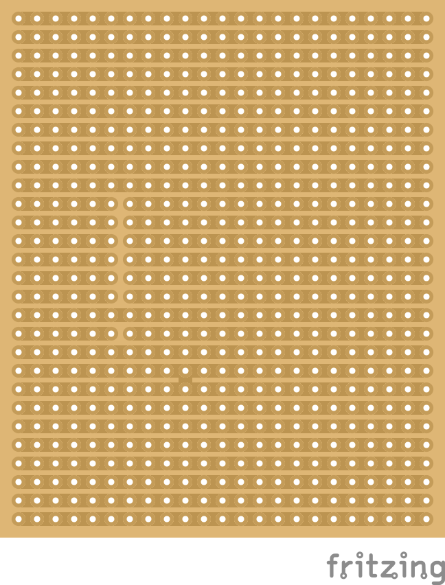

! This is work in progress - check for updates soon - june 17th 2019 !

# Musikkiste
diy mp3 player for kids

## Overview
This is a simple diy mp3 player (not only) for kids. Is is based on the DFrobot Mp3 Mini module wich has everything onboard. No programming required. 

Volume adjustments are done with the potentiometer. It is possible to use the buttons on the mp3 Module. I will max the volume after powerloss though. 

## Parts

|item           |amount       |description|
|---            |---          |---|
|mp3 module     |1            |https://wiki.dfrobot.com/DFPlayer_Mini_SKU_DFR0299  |
|speaker        |1            |3 watt speaker for arduino / raspberry pi           |
|resistors      |2 each       |200k, 100k, 51k, 33k, 24k, 15k, 9.1k, 6.2k, 3k      |
|power source   |1            |usb powerbank or 4.5V battery compartment           |
|potentiometer  |1            |1OO Ohm linear                                      |
|housing        |1            |any box                                             |
|jumperwires    |20           |dupond 1pin female for buttons / powersource / potentiometer                     |
|copper wire    |1            |for ground connection between the buttons           |
|pin header     |2            |1 x 10  for buttons                                 |
|pin header     |2            |1 X 8 male for mp3 Module out                       |
|pin header     |2            |1 x 8 female for mp3 Module                         |
|microSD card   |1            |fat16/fat32 up to 32GB                              |

## Copy Files
The Order in which the files are copied onto the microSD card defines which button they are assigned to. i.e. the first file is Segement 1.

## Instructions
To prepare the PCB disconnect 7 lines on as show here (as seen from above).

PCB with all parts soldered in (as seen from above).

PCB with the mp3 module plugged in and external components (as seen from above).

