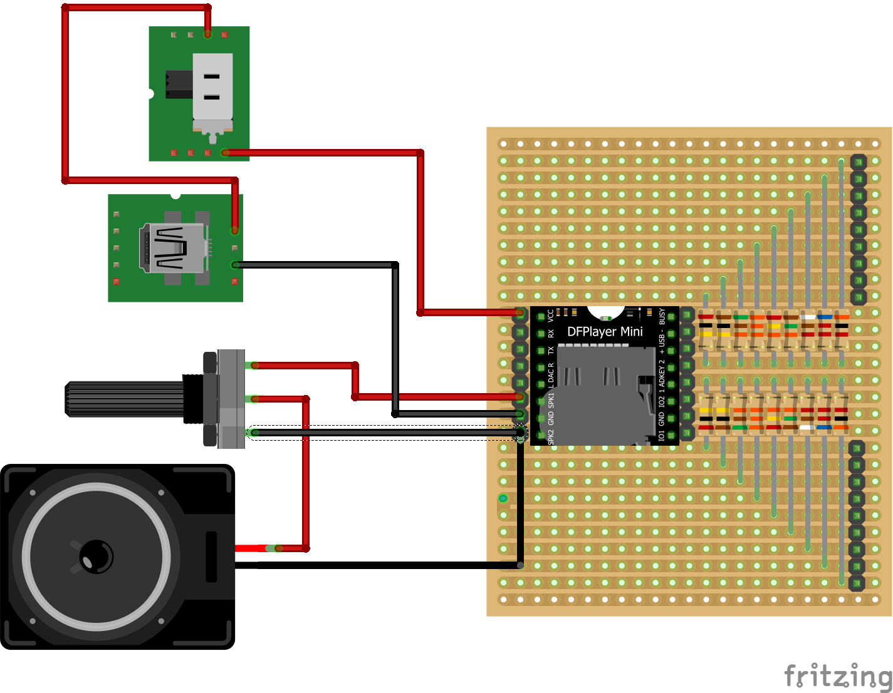

# Musikkiste
diy mp3 player for kids

## Overview
This is a simple diy mp3 player for kids. Is is based on the DFrobot Mp3 Mini module wich has everything onboard. No programming required. It is a very basic build. If all parts are available it should not take longer than an afternoon to build. 

Volume adjustments are done with the potentiometer. It is possible to use the buttons on the mp3 Module. I will max the volume after powerloss though. 

## Parts

|item           |amount       |description|
|---            |---          |---|
|mp3 module     |1            |https://wiki.dfrobot.com/DFPlayer_Mini_SKU_DFR0299  |
|speaker        |1            |3 watt speaker for arduino / raspberry pi           |
|resistors      |2 each       |200k, 100k, 51k, 33k, 24k, 15k, 9.1k, 6.2k, 3k      |
|power source   |1            |usb powerbank or 4.5V battery compartment           |
|potentiometer  |1            |1OO Ohm linear                                      |
|housing        |1            |any box                                             |
|jumperwires    |20           |dupond 1pin female for buttons / powersource / potentiometer                     |
|copper wire    |1            |for ground connection between the buttons           |
|pin header     |2            |1 x 10  for buttons                                 |
|pin header     |2            |1 X 8 male for mp3 Module out                       |
|pin header     |2            |1 x 8 female for mp3 Module (optional)              |
|microSD card   |1            |fat16/fat32 up to 32GB                              |
|box            |1            |any box will do, wood, 3dprinted,...                |

## Soldering
The pin headers for the mp3 module are not really needed, but for some reason i like the idea of beeing able to replace it without soldering. 

### Pin headers
Not all output pins of the mp3 module are used in this build. But it is just more convinient to solder on strip of pin headers. 

### Resistors
As with the pin headers, not all resistors are needed. Just for expandability they are just included. 

## Plug in Module
Plug in with the text readable, tf-slot facing south.

## Power cable assembly
NN

## Speaker cable assembly
NN

## Plug in cables
- Power cable assembly into VCC
- Power cable assembly GND into GND on the left
- Speaker assembly red into SPK_1
- Speaker assembly black into SPK_2

|Cable                |Pin      |MODULE   |PIN      |Cable                    |
|---                  |---      |---      |---      |---                      |
|Power cable red      |VCC      |MODULE   |BUSY     |NC                       |
|NC                   |RX       |MODULE   |USB-     |NC                       |
|NC                   |TX       |MODULE   |USB+     |NC                       |
|NC                   |DAC_R    |MODULE   |ADKEY_2  |Button # 05              |
|NC                   |DAC_l    |MODULE   |ADKEY_1  |Button # 01              |
|Speaker cable red    |SPK_1    |MODULE   |IO_2     |NC                       |
|Power cable red      |GND      |MODULE   |GND      |Butten cable black       |
|Speaker cable black  |SPK_2    |MODULE   |IO_1     |NC                       |

|ADKEY #              |Resitor    |Button #   |
|---                  |---        |---        |
|1                    |33k        |Play/Pause |
|1                    |9.1k       |04         |
|1                    |6.2k       |03         |
|1                    |3k         |02         |
|2                    |200k       |14         |
|2                    |100k       |13         |
|2                    |51k        |12         |
|2                    |33k        |11         |
|2                    |24k        |10         |
|2                    |15k        |09         |
|2                    |9.1k       |08         |
|2                    |6.2k       |07         |
|2                    |3k         |06         |

Use the pinmap: https://wiki.dfrobot.com/DFPlayer_Mini_SKU_DFR0299 as reference. 
(NC = Not connected)

## Copy Files
The Order in which the files are copied onto the microSD card defines which button they are assigned to. i.e. the first file is Segement 1.

## Instructions
To prepare the PCB disconnect 7 lines on as show here:

Place the pin headers: 

Solder pin headers:

PCB with all parts soldered in (as seen from above).

PCB with the mp3 module plugged in and external components (as seen from above).

## Tools required
- soldering iron
- wire cutter
- utility knive
- drill 

